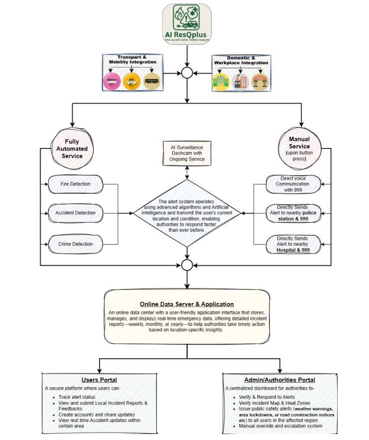
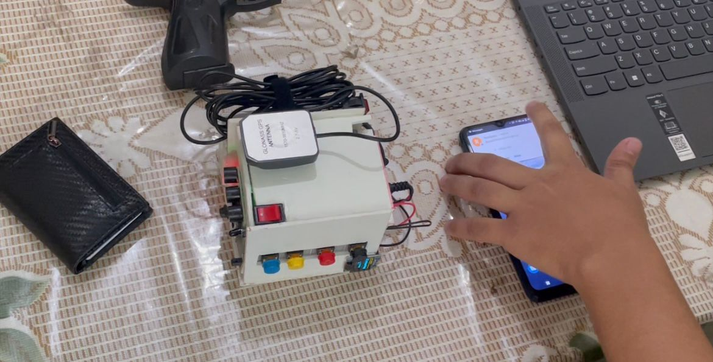

# AI ResQPlus (IoT + AI)

**Status:** Private / Confidential Project  

## Description
An IoT-based rescue system integrating fire, accident, and criminal activity detection with AI-driven alerts for emergency response.  
This project uses AI algorithms for real-time detection and automated notifications to responders.

## Features
- Real-time AI-based detection of fire, accidents, and suspicious activity  
- Automated emergency alerts  
- IoT-connected sensors and devices  
- System overview and setup explained through images  

## Images

### Device Photo

### Meeting with VC

### System Overview

